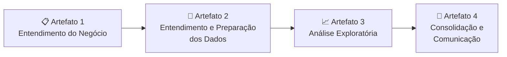

<div align="center">

# 🦠 COVID-19 no Brasil: Casos Graves, Óbitos e Vacinação (2020–2023)

**Análise dos casos graves e óbitos por COVID-19 no Brasil e sua associação com a cobertura vacinal**

[](https://www.python.org/)
[](https://jupyter.org/)
[](https://pandas.pydata.org/)
[](#-metodologia)
[](https://colab.research.google.com/github/SEU_USUARIO/NOME_DO_REPO/blob/main/Projeto_Aplicado_1_Artefato_4.ipynb)

*Projeto Aplicado I · Pós-Graduação em Análise Estratégica de Dados · IFMG Campus Formiga*

</div>

---

## 📌 Sobre o projeto

A pandemia de COVID-19 teve impactos muito diferentes entre regiões, faixas etárias e períodos. Este projeto usa dados oficiais do Ministério da Saúde para investigar **como evoluíram os casos graves (SRAG) e os óbitos por COVID-19**, **como se comportou a aplicação de vacinas** e **se há indícios de associação entre esses dois fenômenos**.

O público-alvo são **gestores públicos de saúde**, que precisam entender esses padrões para apoiar decisões sobre priorização de grupos vulneráveis e planejamento de políticas de vacinação e resposta a emergências sanitárias.

> [!NOTE]
> A base do SIVEP-Gripe registra apenas **casos graves e hospitalizados (SRAG)**, e não todos os casos confirmados de COVID-19. Esse recorte é uma escolha metodológica: os indicadores de "casos" e "letalidade" deste estudo se referem aos casos graves.

## ❓ Perguntas de negócio

| # | Pergunta |
|:-:|---|
| **P1** | Como evoluíram os casos graves (SRAG) e os óbitos por COVID-19 no Brasil entre 2020 e 2023? |
| **P2** | Existem diferenças relevantes na letalidade por COVID-19 entre as regiões brasileiras? |
| **P3** | Como evoluiu o volume de doses de vacina aplicadas no Brasil ao longo do período analisado? |
| **P4** | Como as doses aplicadas se distribuem entre as diferentes regiões do país? |
| **P5** | Quais faixas etárias apresentaram maior letalidade entre os casos de SRAG por COVID-19? |
| **P6** | Há indícios de associação entre o volume de doses aplicadas e a letalidade por faixa etária? |
| **P7** | Quais grupos prioritários concentraram o maior volume de doses aplicadas? |
| **P8** | Existe diferença relevante entre homens e mulheres no volume de doses aplicadas? |

## 📊 Principais resultados

| # | Achado |
|:-:|---|
| **P1** | O pico mensal ocorreu em **março de 2021**, com **280.742 casos graves** e **102.988 óbitos**. O ano de 2021 concentrou a maior parte dos casos e óbitos do período. |
| **P2** | A letalidade variou de **36,09% no Norte** a **27,02% no Sul**. |
| **P3** | **2021** foi o ano de maior vacinação: **341 milhões de doses**, ou **65,96%** de todas as doses aplicadas entre 2021 e 2023. |
| **P4** | O **Sudeste** concentrou **45,31%** das doses aplicadas no país. |
| **P5** | A faixa de **65 anos ou mais** teve a maior letalidade: **45,55%**. |
| **P6** | A letalidade cresce fortemente com a idade, e as faixas de maior letalidade receberam mais doses, um padrão consistente com a priorização da campanha por vulnerabilidade. |
| **P7** | Os **3 maiores grupos prioritários** concentraram **87,11%** das doses. Os **10 maiores** concentraram **97,90%**. |
| **P8** | Diferença de **36,8 milhões de doses** entre os gêneros, o que corresponde a **15,09%** em relação ao menor volume. |

> [!IMPORTANT]
> As bases são **agregadas** e não vinculam vacinação e desfecho no nível individual. As relações observadas (especialmente na P6) são **associações exploratórias**, e não evidência de causa e efeito.

## 🗂️ Fontes de dados

| Base | Conteúdo | Período | Fonte |
|---|---|---|---|
| **SIVEP-Gripe / SRAG** | Casos graves e óbitos por semana epidemiológica, município e faixa etária | 2020–2023 | [Dados Abertos SUS](https://dadosabertos.saude.gov.br/dataset/srag-2019-a-2026) · [GitLab (dados unificados)](https://gitlab.com/cgcovid/dados-publicos/-/tree/main/Dados%20unificados/Unificado%20Srag) |
| **Vacinômetro COVID-19** | Doses aplicadas por UF/gênero, data, grupo prioritário e faixa etária | 2021–2023 | [Painel Vacinômetro](https://infoms.saude.gov.br/extensions/SEIDIGI_DEMAS_Vacina_C19/SEIDIGI_DEMAS_Vacina_C19.html) |

Os dados já são disponibilizados de forma agregada e anonimizada pelo Ministério da Saúde, em conformidade com a LGPD.

## 🧭 Metodologia

O projeto segue a metodologia **CRISP-DM** e foi desenvolvido em quatro entregas incrementais, todas reunidas no mesmo notebook:



| Artefato | O que foi feito |
|---|---|
| **1. Entendimento do Negócio** | Contextualização, problema, objetivos, perguntas P1–P8 e definição das fontes |
| **2. Preparação dos Dados** | Consolidação dos arquivos anuais, padronização de UF/município, conversão de semana epidemiológica em mês, reagrupamento de faixas etárias e validação |
| **3. Análise Exploratória** | Estatísticas descritivas, séries temporais, rankings, dispersão, correlações exploratórias e boxplots |
| **4. Consolidação** | Síntese executiva, conclusões, limitações e sugestões de continuidade |

## 📁 Estrutura do repositório

```
.
├── Projeto_Aplicado_1_Artefato_4.ipynb   # Notebook completo (Artefatos 1 a 4)
└── README.md
```

## ▶️ Como executar

O notebook foi desenvolvido no **Google Colab** e lê os dados a partir do Google Drive.

1. Baixe as bases nas fontes listadas acima.
2. Organize os arquivos no seu Google Drive nestas pastas:
   ```
   MyDrive/base_de_dados/obitos_unificadas/      # arquivos anuais do SIVEP-Gripe (covid_*.xlsx)
   MyDrive/base_de_dados/cobertura_vacinal/      # exportações do Vacinômetro
   ```
3. Abra o notebook no Colab pelo botão **Open in Colab** acima.
4. Execute as células em ordem e autorize o acesso ao Drive quando solicitado.

**Bibliotecas:** `pandas`, `numpy`, `matplotlib`, `seaborn`

> [!TIP]
> Para só visualizar as análises não é preciso executar nada: o GitHub renderiza o notebook com todos os gráficos e tabelas.

## ⚠️ Limitações

- Os casos analisados são **casos graves (SRAG)**, e não o total de infecções por COVID-19.
- Os dados são **agregados**: não há vínculo individual entre vacinação e desfecho.
- As faixas etárias da vacinação precisaram ser **reagrupadas** para ficarem compatíveis com a base de casos, o que reduz a precisão da comparação na P6.
- **Doses aplicadas não equivalem a cobertura vacinal**: estimar cobertura exigiria uma população de referência e a definição de um esquema vacinal.
- As análises são **descritivas e exploratórias**, sem inferência causal.

## 🔭 Trabalhos futuros

- Análise causal com dados individualizados e anonimizados
- Inclusão de variáveis socioeconômicas e de infraestrutura de saúde (IDH, renda, leitos)
- Estudo de sazonalidade e das ondas epidêmicas associadas a variantes
- Modelagem preditiva de risco por cenário de vacinação, faixa etária e região

## 👥 Autores

**Dupla 14**

- Henrikesen Douglas Alves da Silva
- Wellyson Yago Monteiro da Silva

**Orientação:** Prof. Diego Mello da Silva · Prof. Marco Antônio Silva Pereira

---

<div align="center">
<sub>Instituto Federal de Minas Gerais (IFMG) · Campus Formiga · Pós-Graduação Lato Sensu em Análise Estratégica de Dados</sub>
</div>
